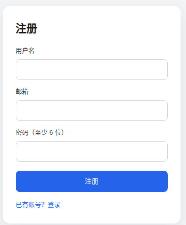
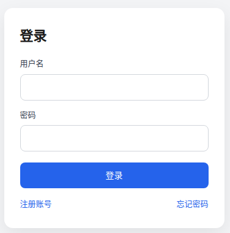
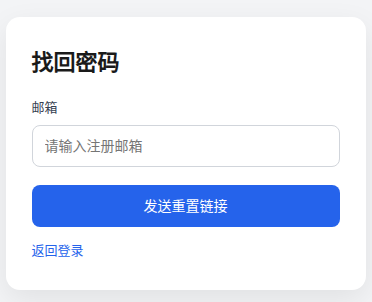
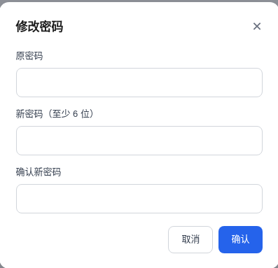
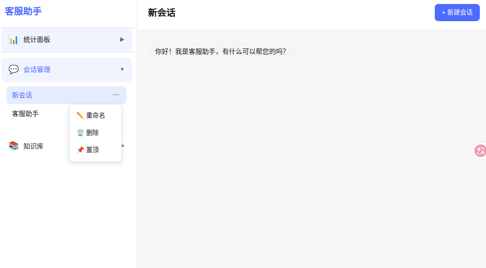
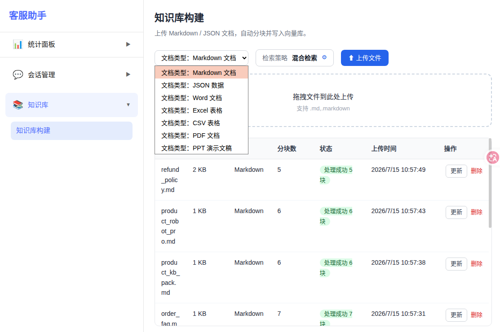
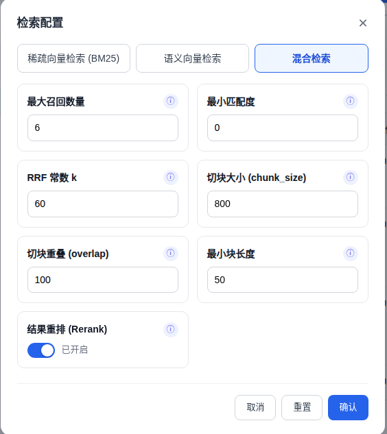

# auth & sessions
> 用户和会话模块
## auth
+ 注册



+ 登陆



+ 找回密码



+ 重置密码



> JWT: 服务器无法主动实效，要想主动实效需要在本地持久化存储

## sessions

+ 新建会话
+ 历史会话
+ 删除会话
+ 重命名会话




# 知识库
> rag模块

+ 文档类型选择
+ 知识文档上传
+ 知识文档更新
+ 知识文档删除



+ 检索策略配置



# 客服Agent
> 智能客服对话
> 单轮的核心判定：消息里已带齐所需槽位，路由一次命中、直接返回结果。
> 多轮的核心排定：消息不全，需要用户补充


对话示例
| 角色 | 消息 | 意图 |
| --- | --- | --- |
| user | 你好 | |
| assistant | 你好，我可以帮你查询订单、物流、退款售后问题，也可以为你转人工客服。 | |
| user | 查订单 | order-query|
| assistant | 请提供订单号，我来帮你查询订单状态。 |solt 澄清|
| user | A01 | |
| assistant | 订单 A01 没有查询到相关订单信息，请确认订单号后重试。 | |
| user | A1001 | |
| assistant | 订单 A1001 当前状态为 已发货，商品是 智能客服机器人 Pro，金额 1999.0 元。 | 执行query_order工具|
| user | A1002 | |
| assistant | 订单 A1002 当前状态为 待付款，商品是 知识库增强包，金额 399.0 元。 | 意图继承|
| user | 查一下两个订单的物流 | 意图切换-物流、solt继承|
| assistant | 订单 A1001 当前物流状态为 运输中，最近一条记录是 2026-07-03 10:00 派送中。 订单 A1002 没有查询到相关物流信息，请确认订单号后重试。 | |
| user | 如何退换货 | 意图切换-售后|
| assistant | 您好，关于退换货流程及相关政策，为您整理如下： **1. 标准退换货流程** * **申请售后**：在「我的订单」中选择需要售后的商品，点击“申请售后”； * **选择类型**：根据需求选择“仅退款”、“退货退款”或“换货”； * **填写信息**：填写原因并上传凭证（如有质量问题需提供）； * **等待审核**：商家审核通过后，请按提示寄回商品； * **完成处理**：商家收货验收后，将完成退款或安排换货发货。 **2. 七天无理由退货说明** * **时效**：自商品签收之日起 7 天内（含签收当日）可申请，无需说明理由。 * **条件**：商品需保持完好、不影响二次销售，且配件、赠品、发票（如有）需一并退回。 * **例外**：定制类、虚拟类、生鲜类商品不支持七天无理由退货。 * **退款方式**：原路退回至原支付账户。 **3. 运费承担规则** * **质量问题**：如商品存在功能性故障、与描述严重不符或运输导致的破损/污损（需签收时或签收后48小时内举证），往返运费由**商家承担**。 * **非质量问题**：七天无理由退货的往返运费由**用户承担**。 **4. 换货说明** * 适用于尺寸不符、颜色选错、收到错货等情形。若库存充足将优先补发，库存不足时可协商转为退款。 如有其他疑问，欢迎随时咨询。 |rag 查询 |
| user | 帮我把A1002退掉 | 意图切换-refund|
| assistant | ⚠️ 即将为订单 A1002 发起【退款】申请，该操作不可撤销。请确认是否继续？确认请直接回复「确认」。 | |
| user | 确认 | |
| assistant | 已为订单 A1002 提交退款申请，受理单号 R2001。 | |

耗时统计
```md
[chat] 发送成功 响应时间=1313ms 平均=3974ms 次数=83
[chat] 发送成功 响应时间=1354ms 平均=3942ms 次数=84
[chat] 发送成功 响应时间=5399ms 平均=3960ms 次数=85
[chat] 发送成功 响应时间=2840ms 平均=3946ms 次数=86
[chat] 发送成功 响应时间=2940ms 平均=3935ms 次数=87
[chat] 发送成功 响应时间=4020ms 平均=3936ms 次数=88
[chat] 发送成功 响应时间=12894ms 平均=4037ms 次数=89
[chat] 发送成功 响应时间=2656ms 平均=4021ms 次数=90
[chat] 发送成功 响应时间=100ms 平均=3978ms 次数=91
```

