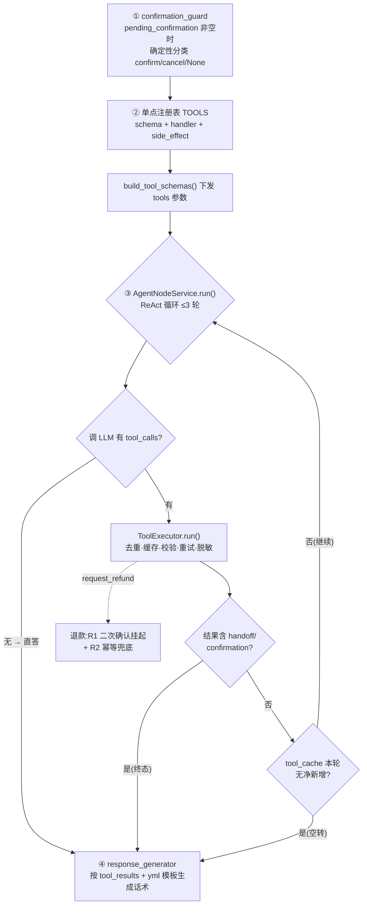

# 项目架构

> 客服Agent :  https://github.com/JCCGGKS/myagent

## 项目技术栈

| 技术层级 | 选型 | 一句话说明 |
| --- | --- | --- |
| 前端基础框架 | Vue 3 + TypeScript + Vite + Pinia + Vue Router | 现代前端工程，构建快 |
| 后端基础框架 | Python 3.11 + FastAPI + Uvicorn | 异步高性能，SSE 流式输出（text/event-stream） |
| 认证 | JWT（PyJWT + bcrypt） | 登录鉴权 + 请求鉴权中间件，Bearer Token |
| Agent 编排 | LangGraph + langchain-core | 用 StateGraph(dict) 把对话节点串成 DAG，本项目的核心骨架 |
| 大模型 / Embedding / Rerank | 通义千问 DashScope（OpenAI 兼容） | 对话 qwen3.7-plus / embedding text-embedding-v4 / rerank qwen3-rerank |
| 检索（向量 + 关键词） | Qdrant（向量语义 + 自研稀疏向量 BM25） | 向量语义检索 + BM25 稀疏向量（正则分词，中文按字切），两路并行召回做 RRF 融合 |
| 关系库 | MySQL 8（SQLAlchemy 2.0 + aiomysql） | 业务/会话/事件日志落库，未配则回退内存实现 |
| 缓存 / 会话 | Redis | LangGraph 图态持久化（checkpointer），未配回退 MemorySaver |
| 日志 | Python 标准 logging（module_logger）+ TraceId 全链路 | 分模块日志（graph/intent/agent/tool/rag/response/context/api/auth），每请求 X-Trace-Id 全链路追踪 |
| 部署 | Docker Compose | 一条命令拉起 MySQL / Redis / Qdrant |

## 项目结构

```
myagent/
├── app/
│   ├── api/         # FastAPI 入口：app.py / chat.py / auth.py / rag.py，仅装配路由
│   ├── business/    # 业务逻辑层（agent / intent / dialog / tools / rag / context / auth / prompts / memory）
│   ├── config/      # 配置加载（settings / llm / rag_config / context_config / checkpoint_config / logging_config）
│   ├── dao/         # 数据访问层（session / user / knowledge / knowledge_file / data / event_log）
│   ├── data/        # 独立资源层（orders.json / logistics.json）
│   ├── model/       # SQLAlchemy ORM 表模型（user / session(含 EventLog) / knowledge）
│   ├── middleware/  # auth（JWT）/ cors / trace（TraceId）中间件，统一在 app 装配
│   ├── pkgs/        # 第三方封装（auth: jwt/password/email；llm: client；vector: qdrant）
│   ├── schema/      # Pydantic（chat / auth / intent / state / session / business）
│   └── utils/       # config_paths / state / text / llm / files / module_logger / metrics / trace
├── config/          # 各环境 yml（llm_config.*.yml + 意图/澄清/回复 prompt 模板）
├── eval/            # 评估套件：intent / rag / answer / trajectory 四个子目录
├── frontend/        # Vue 3 前端
├── tests/           # 后端单元测试
├── docs/            # 本地参考文档（gitignore，不提交）
├── wiki/ / template/ / plans/   # 设计文档、调研草稿、实施计划（plans/ 为 gitignore，不提交）
├── docker-compose.yml  # mysql / redis / qdrant 基础设施
├── main.py          # 转发到 app.api.app:app
└── README.md
```

> 分层依赖严格向下、无环：`api → business → dao → model`；`pkgs / utils / schema / data` 为叶子层，不被反向依赖。

## 对话编排（LangGraph）

`CustomerServiceAgent` 用 `StateGraph(dict)` 编排，状态载体为 `{state, request}`。两条条件分支：① `confirmation_guard` 拦截 R1 二次确认；② `policy_layer` 按 `current_action` 分发到澄清 / 工具 / 转人工 / 直接回复。


> 边界落库：节点只收集数据，`chat()` 跑完由 `MessageService.persist` 批量落库；`chat_events()` 用 `astream` 边跑边下推 `intent/state/tool_result` 事件，`final` 在落库后下发。图态经 checkpointer 持久化（`thread_id = session_id`），优先 Redis、回退 `MemorySaver`。
>
> 情绪识别（`emotion_rec`）：在 `intent_router` 内并行做「规则 + LLM」双路识别，合并后写入 `state.emotion`（negative / positive / neutral），**不参与路由分支**——仅以虚线所示作为语气信号透传给澄清 / 回复生成节点，`negative` 时确定性「先安抚再作答」。
>
> 工具脱敏：`agent_node` 调用执行层 `ToolExecutor.run()`（`tool_executor.py:296`）对 handler 返回的 `raw_result` **集中脱敏**生成 `sanitized_result`；`response_generator` 仅用脱敏副本拼回复，`raw_result` 仅留内部、不跨信任边界（虚线所示）。脱敏在执行层统一收口，非独立图节点。

## 工具编排

### 工具编排链路（核心流程）

工具从「定义」到「回复」的核心链路如下：



> **终止信号（确定性，不靠 LLM 自觉停，对应 `agent_node.py` ReAct 循环）**：① `confirmation_guard` 前置闸门——`pending_confirmation` 非空时由 `classify_confirm_signal` 确定性拦截「确认/取消」信号，退款等高风险动作不经 `agent_node` 直接闭环；② 终态工具结果——`state.tool_results` 中任一 `kind ∈ {handoff, confirmation}`（代码产出，非 LLM 文本判断）→ 立即 break，动作已闭环；③ 无净新增执行——本轮 `tool_cache` 键数较执行前未增加（调用全命中执行层缓存或批次内去重）→ break，防 LLM 空转重发；④ 无 `tool_calls`——LLM 响应无工具调用即 break，仅当整轮从未调工具才将 content 写入 `state.reply` 直答；⑤ 轮次硬上限 `max_tool_rounds=3`。
>
> **进一步优化：rag 结果相似度去重**：现有 `tool_cache` 仅按「工具 + 参数」精确去重，能拦非 rag 工具的同参重复执行，却拦不住 `rag_retrieve` 的「换近义词重搜」（不同 query 即不同参数，被当作新调用一路跑到轮次上限）。优化方向：去重逻辑按工具类型分流——**非 rag 工具继续走参数级去重**；**`rag_retrieve` 改走结果相似度去重**，每轮将检索返回的文档与之前几轮结果比相似度（用 embedding，中文近义词也能识别），连续数轮高度相似即视为重复、提前终止循环。该逻辑只作用于 rag 这类只读检索工具，不影响退款 / 转人工等副作用工具，且复用现有早停 guard 结构，改动小。

### 可用工具

`agent_node` 通过 LLM function calling 调用工具，全部由 `ToolExecutor` 统一执行（`TOOLS` 单点注册，`build_tool_schemas()` 下发 schema）。当前共 7 个工具，按职责分 4 类：

| 类别 | 工具 | 作用 | 副作用 |
| --- | --- | --- | --- |
| 知识检索 | `rag_retrieve` | 检索知识库，回答退款政策 / 规则等咨询类问题 | 无 |
| 订单查询（只读） | `query_order` | 查订单状态 / 商品 / 金额 / 是否发货 | 无 |
| 订单查询（只读） | `query_logistics` | 查已发货后的物流运输进度 | 无 |
| 售后办理 | `request_refund` | 退款 / 退货 / 换货 / 维修（动钱，受 R1 二次确认约束） | 有 |
| 售后办理 | `modify_address` | 修改订单收货地址 | 有 |
| 售后办理 | `apply_invoice` | 开具电子发票 | 有 |
| 转人工 | `create_handoff` | 转接人工客服（用户要求 / 情绪升级 / 多次澄清失败） | 有 |

- **带副作用工具**（`side_effect=True`：`request_refund` / `modify_address` / `apply_invoice` / `create_handoff`）不参与自动重试，仅模型软重试 + 幂等兜底，避免重复触发。
- 退款类工具受 **R1 二次确认**约束：首次 `confirm=false` 仅返回确认提示，用户明确「确认」后下一轮 `confirm=true` 才真正办理。
- LLM 可能返回历史别名（如 `refund` / `return` / `handoff_service`），由 `TOOL_ALIASES` 归并到规范名。
