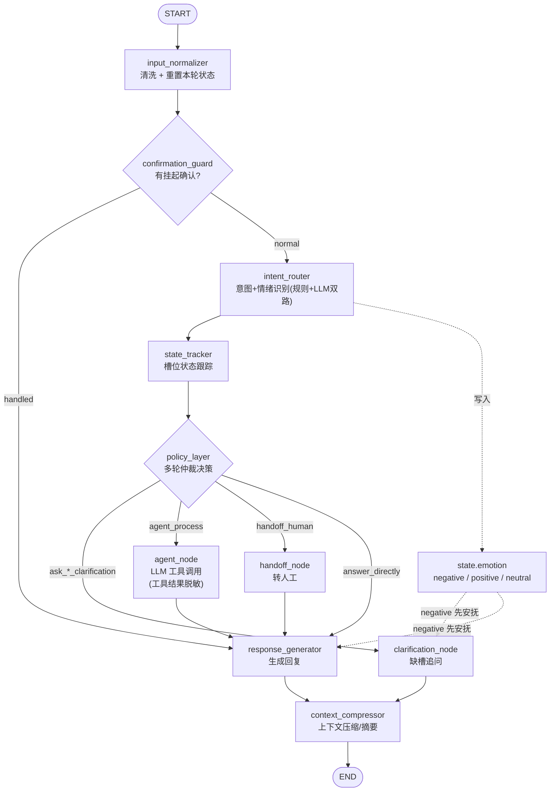
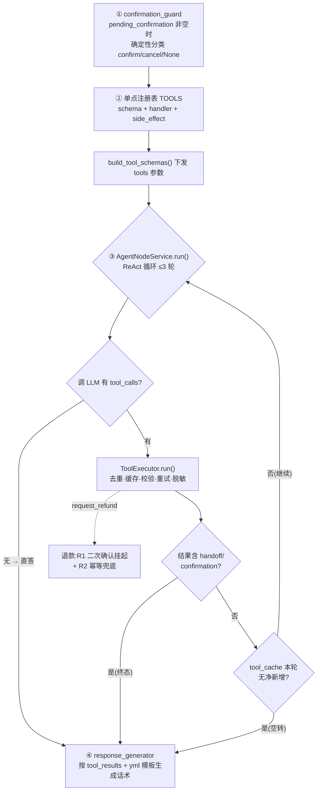
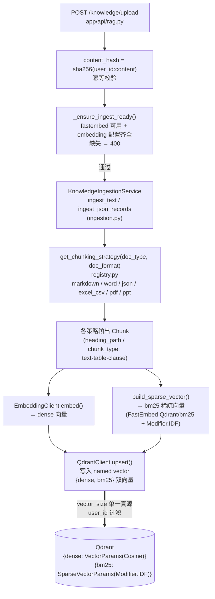
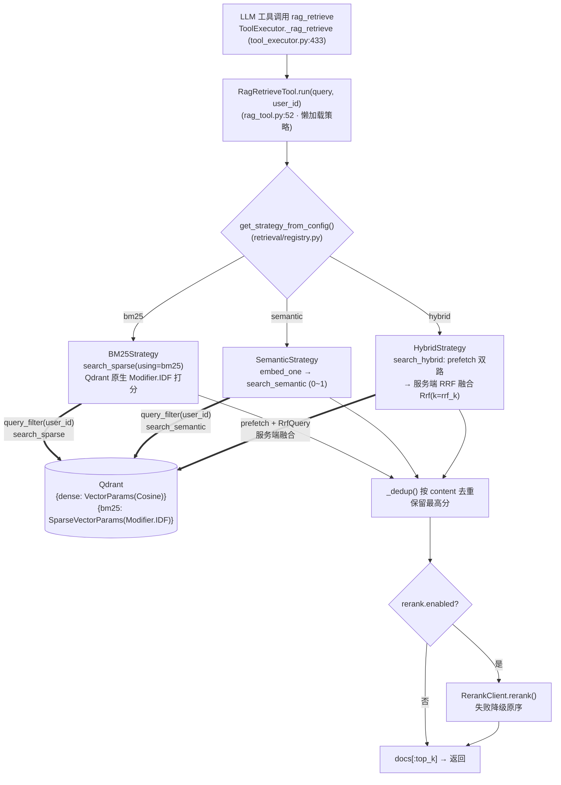
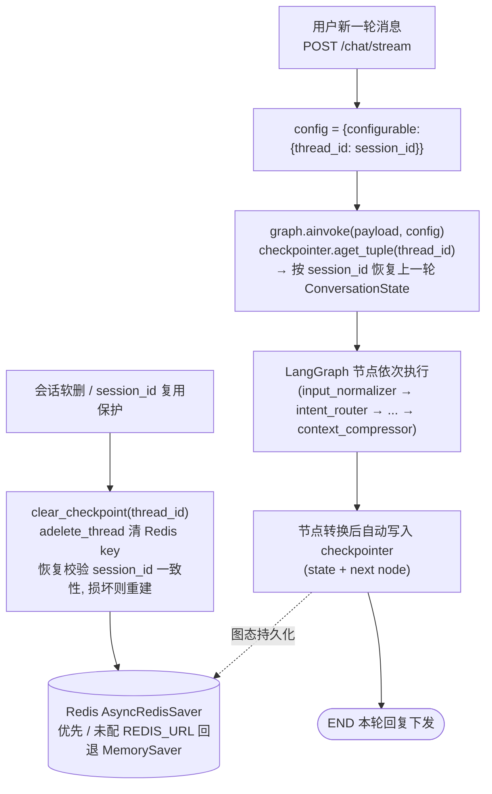
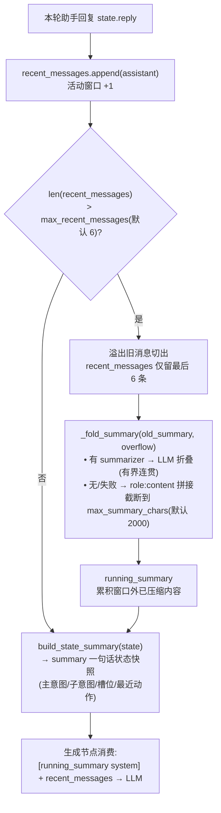
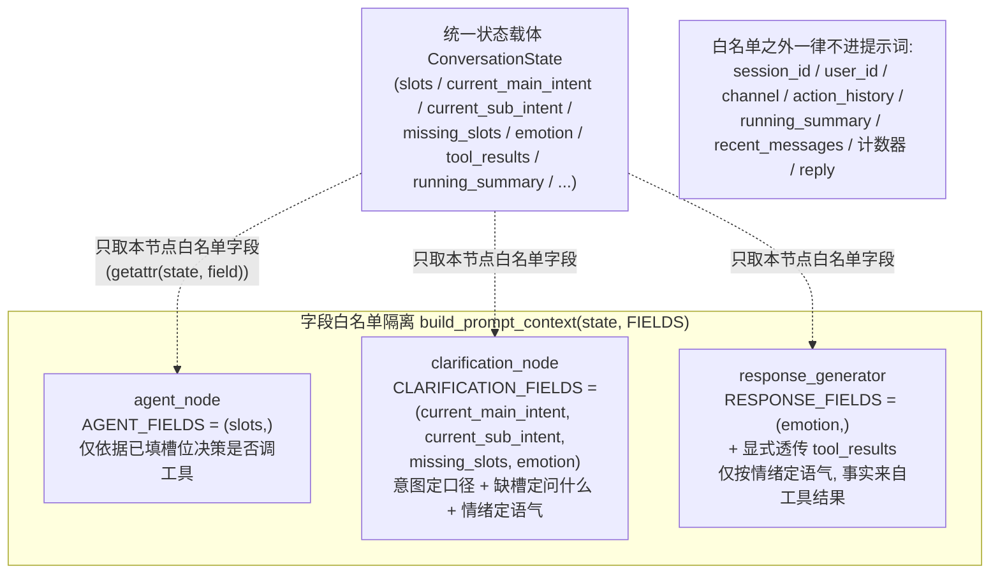

# 项目架构

> 客服Agent :  https://github.com/JCCGGKS/myagent

## 项目技术栈

| 技术层级 | 选型 | 一句话说明 |
| --- | --- | --- |
| 前端基础框架 | Vue 3 + TypeScript + Vite + Pinia + Vue Router | 现代前端工程，构建快 |
| 后端基础框架 | Python 3.11 + FastAPI + Uvicorn | 异步高性能，SSE 流式输出（text/event-stream） |
| 认证 | JWT（PyJWT + bcrypt） | 登录鉴权 + 请求鉴权中间件，Bearer Token |
| Agent 编排 | LangGraph + langchain-core | 用 StateGraph(dict) 把对话节点串成 DAG，本项目的核心骨架 |
| 大模型 / Embedding / Rerank | 通义千问 DashScope（OpenAI 兼容） | 对话 qwen3.7-plus / embedding text-embedding-v4 / rerank qwen3-rerank |
| 检索（向量语义 + 关键词 BM25） | Qdrant 原生 BM25（稀疏向量 + Modifier.IDF）+ Qdrant 向量语义 | Qdrant 原生 BM25（FastEmbed `Qdrant/bm25` 稀疏向量 + 服务端 IDF 加权打分，跨 worker 一致）+ Qdrant 语义；双向量统一入库、hybrid 经服务端 RRF 融合 |
| 关系库 | MySQL 8（SQLAlchemy 2.0 + aiomysql） | 业务/会话/事件日志落库，未配则回退内存实现 |
| 缓存 / 会话 | Redis | LangGraph 图态持久化（checkpointer），未配回退 MemorySaver |
| 日志 | Python 标准 logging（module_logger）+ TraceId 全链路 | 分模块日志（graph/intent/agent/tool/rag/response/context/api/auth），每请求 X-Trace-Id 全链路追踪 |
| 部署 | Docker Compose | 一条命令拉起 MySQL / Redis / Qdrant |

## 项目结构

```
myagent/
├── app/
│   ├── api/         # FastAPI 入口：app.py / chat.py / auth.py / rag.py，仅装配路由
│   ├── business/    # 业务逻辑层（agent / intent / dialog / tools / rag / context / auth / prompts / memory）
│   ├── config/      # 配置加载（settings / llm / rag_config / context_config / checkpoint_config / logging_config）
│   ├── dao/         # 数据访问层（session / user / knowledge / knowledge_file / data / event_log）
│   ├── data/        # 独立资源层（orders.json / logistics.json）
│   ├── model/       # SQLAlchemy ORM 表模型（user / session(含 EventLog) / knowledge）
│   ├── middleware/  # auth（JWT）/ cors / trace（TraceId）中间件，统一在 app 装配
│   ├── pkgs/        # 第三方封装（auth: jwt/password/email；llm: client；vector: qdrant）
│   ├── schema/      # Pydantic（chat / auth / intent / state / session / business）
│   └── utils/       # config_paths / state / text / llm / files / module_logger / metrics / trace
├── config/          # 各环境 yml（llm_config.*.yml + 意图/澄清/回复 prompt 模板）
├── eval/            # 评估套件：intent / rag / answer / trajectory 四个子目录
├── frontend/        # Vue 3 前端
├── tests/           # 后端单元测试
├── docs/            # 本地参考文档（gitignore，不提交）
├── wiki/ / template/ / plans/   # 设计文档、调研草稿、实施计划（plans/ 为 gitignore，不提交）
├── docker-compose.yml  # mysql / redis / qdrant 基础设施
├── main.py          # 转发到 app.api.app:app
└── README.md
```

> 分层依赖严格向下、无环：`api → business → dao → model`；`pkgs / utils / schema / data` 为叶子层，不被反向依赖。

## 对话编排（LangGraph）

`CustomerServiceAgent` 用 `StateGraph(dict)` 编排，状态载体为 `{state, request}`。两条条件分支：① `confirmation_guard` 拦截 R1 二次确认；② `policy_layer` 按 `current_action` 分发到澄清 / 工具 / 转人工 / 直接回复。



> 边界落库：节点只收集数据，`chat()` 跑完由 `MessageService.persist` 批量落库；`chat_events()` 用 `astream` 边跑边下推 `intent/state/tool_result` 事件，`final` 在落库后下发。图态经 checkpointer 持久化（`thread_id = session_id`），优先 Redis、回退 `MemorySaver`。
>
> 情绪识别（`emotion_rec`）：在 `intent_router` 内并行做「规则 + LLM」双路识别，合并后写入 `state.emotion`（negative / positive / neutral），**不参与路由分支**——仅以虚线所示作为语气信号透传给澄清 / 回复生成节点，`negative` 时确定性「先安抚再作答」。
>
> 工具脱敏：`agent_node` 调用执行层 `ToolExecutor.run()`（`tool_executor.py:296`）对 handler 返回的 `raw_result` **集中脱敏**生成 `sanitized_result`；`response_generator` 仅用脱敏副本拼回复，`raw_result` 仅留内部、不跨信任边界（虚线所示）。脱敏在执行层统一收口，非独立图节点。

## 工具编排

### 工具编排链路（核心流程）

工具从「定义」到「回复」的核心链路如下：



> **终止信号（确定性，不靠 LLM 自觉停，对应 `agent_node.py` ReAct 循环）**：① `confirmation_guard` 前置闸门——`pending_confirmation` 非空时由 `classify_confirm_signal` 确定性拦截「确认/取消」信号，退款等高风险动作不经 `agent_node` 直接闭环；② 终态工具结果——`state.tool_results` 中任一 `kind ∈ {handoff, confirmation}`（代码产出，非 LLM 文本判断）→ 立即 break，动作已闭环；③ 无净新增执行——本轮 `tool_cache` 键数较执行前未增加（调用全命中执行层缓存或批次内去重）→ break，防 LLM 空转重发；④ 无 `tool_calls`——LLM 响应无工具调用即 break，仅当整轮从未调工具才将 content 写入 `state.reply` 直答；⑤ 轮次硬上限 `max_tool_rounds=3`。
>
> **进一步优化：rag 结果相似度去重**：现有 `tool_cache` 仅按「工具 + 参数」精确去重，能拦非 rag 工具的同参重复执行，却拦不住 `rag_retrieve` 的「换近义词重搜」（不同 query 即不同参数，被当作新调用一路跑到轮次上限）。优化方向：去重逻辑按工具类型分流——**非 rag 工具继续走参数级去重**；**`rag_retrieve` 改走结果相似度去重**，每轮将检索返回的文档与之前几轮结果比相似度（用 embedding，中文近义词也能识别），连续数轮高度相似即视为重复、提前终止循环。该逻辑只作用于 rag 这类只读检索工具，不影响退款 / 转人工等副作用工具，且复用现有早停 guard 结构，改动小。

### 可用工具

`agent_node` 通过 LLM function calling 调用工具，全部由 `ToolExecutor` 统一执行（`TOOLS` 单点注册，`build_tool_schemas()` 下发 schema）。当前共 7 个工具，按职责分 4 类：

| 类别 | 工具 | 作用 | 副作用 |
| --- | --- | --- | --- |
| 知识检索 | `rag_retrieve` | 检索知识库，回答退款政策 / 规则等咨询类问题 | 无 |
| 订单查询（只读） | `query_order` | 查订单状态 / 商品 / 金额 / 是否发货 | 无 |
| 订单查询（只读） | `query_logistics` | 查已发货后的物流运输进度 | 无 |
| 售后办理 | `request_refund` | 退款 / 退货 / 换货 / 维修（动钱，受 R1 二次确认约束） | 有 |
| 售后办理 | `modify_address` | 修改订单收货地址 | 有 |
| 售后办理 | `apply_invoice` | 开具电子发票 | 有 |
| 转人工 | `create_handoff` | 转接人工客服（用户要求 / 情绪升级 / 多次澄清失败） | 有 |

- **带副作用工具**（`side_effect=True`：`request_refund` / `modify_address` / `apply_invoice` / `create_handoff`）不参与自动重试，仅模型软重试 + 幂等兜底，避免重复触发。
- 退款类工具受 **R1 二次确认**约束：首次 `confirm=false` 仅返回确认提示，用户明确「确认」后下一轮 `confirm=true` 才真正办理。
- LLM 可能返回历史别名（如 `refund` / `return` / `handoff_service`），由 `TOOL_ALIASES` 归并到规范名。

### 转人工触发点（`handoff_human`）

`create_handoff` 工具（副作用，不自动重试）是转人工的落点，但「是否转」由编排层在多个节点判定，共四类入口：

1. **用户明确要求**：`intent_router` 判定主意图为 `handoff_service`（如「转人工」），置 `state.handoff = True`（`routing.py:337`）；同轮内 `HandoffClarificationPolicy.decide` 读到该标志即强制 `current_action = "handoff_human"`（`routing.py:381`）。
2. **多次澄清失败兜底**：连续意图澄清失败达阈值（默认 3，`intent_clarification_count >= handoff_threshold`），`decide` 强制转人工并置 `state.handoff = True` + `handoff_reason = "clarification_failed"`（`routing.py:420-427`）；本轮一旦成功解析/补齐槽位即清零计数，故阈值是「连续失败次数」而非「会话累计」，贴合「真卡住才升级」。
3. **工具侧建单**：`agent_node` 执行 `create_handoff` 工具，或退款默认阶段（`_request_refund_handoff`）建服务单，均置 `state.handoff = True`（`tool_executor.py:497/587`）；`kind=handoff` 的终态工具结果还会触发 agent_node 早停 guard 立即 break。
4. **（设计未落地）情绪升级**：`complaint` / 负向连续曾议作为独立触发点，但当前 `decide` 不读任何情绪字段，情绪仅调语气，故「情绪升级」不是实际触发点。

> **关于「状态复用」的澄清（关键）**：`state.handoff == True` **只在同轮内有效**，是单轮内「前置节点设标志、后续节点消费标志」的传递（如入口 1：`intent_router` 设 → `decide` 消费），**不是跨轮复用**。全部三个置 `True` 的位置（`routing.py:337` / `426`、`tool_executor.py:497` / `587`）都发生在同一轮的处理过程中。每轮开头 `input_normalizer` 强制 `state.handoff = False`（连同 `handoff_reason = ""`，`graph.py:505`），因此即便 checkpointer 按 `thread_id` 恢复了上一轮的 `True`，也会被下一轮开头抹掉、读不到。真正**有意跨轮保留**的是 `pending_confirmation`（R1 二次确认挂起态，每轮不重置）——那才是跨轮闸门；`handoff` 是单轮决策结果，每轮归零。

## RAG 检索链路（离线 + 在线）

> RAG 分**离线（入库）**与**在线（检索）**两阶段：Qdrant 同时存 `dense`（语义召回）与 `bm25`（原生 BM25 稀疏向量召回，`Modifier.IDF` 服务端打分）。**入库统一写双向量**，与检索策略解耦；**检索策略只决定召回用哪路**——`bm25` 走稀疏字段、`semantic` 走稠密字段、`hybrid` 两路 prefetch 后由 **Qdrant 服务端 RRF 融合**。详见下方「BM25 原理与实现」与「① 离线 / ② 在线」两节。

### BM25 原理与实现

**原理**：用官方 `Qdrant/bm25` FastEmbed 稀疏模型（`build_sparse_vector`）把文本编码为稀疏向量，写入 Qdrant 的 `bm25` 命名字段（`SparseVectorParams(modifier=Modifier.IDF)`）。检索时 Qdrant 在该字段上做 **IDF 加权的 TF 点积**打分（`search_sparse`），**全程服务端完成、跨 worker 一致**，无需进程内倒排索引。

**实现**：入库（`ingestion._ingest_chunks`）统一把每个 chunk 的 `bm25` 稀疏向量与 `dense` 稠密向量一并写入 Qdrant；`BM25Strategy` 走 `search_sparse`，`HybridStrategy` 走 `search_hybrid`（prefetch + 服务端 RRF 融合）。原 `BM25Index` / `BM25Store` / `rebuild_from_qdrant` 内存索引已全部移除。

**权衡**：Qdrant `Modifier.IDF` 仅做 `IDF·TF` 点积，不做 Okapi `k1`/`b` 饱和与长度归一，故失去运行时 `bm25_k1`/`bm25_b` 调参（`RagConfig` 已移除）。完整 Okapi BM25 公式为：

```
score(D,Q) = Σ_{t∈Q∩D} IDF(t) · TF(t,D)·(k1+1) / ( TF(t,D) + k1·(1 − b + b·|D|/avgdl) )
IDF(t)      = log( (N − n(t) + 0.5) / (n(t) + 0.5) + 1 )
```

其中 `TF(t,D)` 词频、`|D|`/`avgdl` 文档/平均长度、`N`/`n(t)` 总文档数/含该词文档数；**k1**（≈1.2–2.0）控制词频饱和（抑制同一词反复出现刷分），**b**（≈0.75）控制长度归一（抵消长文档因 token 多而占优）。Qdrant 版本即去掉分母的 k1/b 项，以「服务端打分 + 跨 worker 一致 + 更少代码」换此能力，对短且长度相近的 RAG chunk 影响很小。

### ① 离线阶段 · 入库（write path）




> **分块策略（按 `doc_format` 选择，`registry.get_chunking_strategy`）**：`doc_type` 仅作元信息、不参与策略选择；FAQ 的 JSON / Markdown 文件分别由 `JsonChunkingStrategy` / `MarkdownChunkingStrategy` 处理。公共参数 `chunk_size`(默认 800) / `chunk_overlap`(100) / `min_chunk_size`(50) 来自 `rag` 段，前端可调。

| 文档格式（doc_format） | 分块策略 | 切块粒度 / chunk_type | 关键特征 |
| --- | --- | --- | --- |
| markdown（标题块） | `MarkdownChunkingStrategy` | 标题块 + 问答对 + 递归字符兜底；`chunk_type=text` | 结构为主、问答优先（`Q:`/`答：` 每对一块）、字符兜底；继承 `heading_path` |
| word（标题块） | `WordChunkingStrategy` | 同 Markdown（parser 先抽 `.docx` 成标题树纯文本，复用 `structure_chunk`） | 标题层级 / 问答 / 字符，与 Markdown 同源 |
| json（key-value） | `JsonChunkingStrategy` | 遍历每条记录的每个 key → value 转字符串后走 RecursiveSplitter 切分，key 名写进 metadata（再叠加整条记录的 source 做溯源） | 每块 `metadata.source` = 记录字段 `json.dumps`；FAQ `{question,answer}` 也按记录切 |
| excel / csv（行） | `ExcelCsvChunkingStrategy` | 行级（每数据行一块，重建 `列名=值`）+ 表概要块；`chunk_type=table` | 带 `table_id` / `caption` / `header` / `row_index`；表概要块负责「找表」 |
| pdf（页） | `PdfChunkingStrategy` | 先按「页」这个天然顶层边界切，页内超长再统一递归字符切。 | 表格块委托 Excel 策略；条款按 `第X条` / `（一）` / `1.` 切；跨页由 parser 缝合 |
| ppt（页） | `PptChunkingStrategy` | 先按「页」这个天然顶层边界切，页内超长再统一递归字符切。 | 跨页版式块由 parser 按阅读序缝合 |
| 其它（兜底） | `DefaultTextStrategy`（`RecursiveSplitter`） | 递归字符全量切；`chunk_size` / `overlap` / `min_chunk_size` 可控 | `doc_format` 未命中 `FORMAT_STRATEGIES` 时回退 |

### ② 在线阶段 · 检索（read path）



> **离线要点**：分块用策略模式（markdown 结构为主、问答优先、字符兜底；excel/csv 一行一 chunk 带 `table_id`）；**入库前统一校验依赖与配置齐全**（`_ensure_ingest_ready`：fastembed 已安装 + embedding 配置完整，缺失直接 400）；**每个 chunk 始终同时写 `bm25` 稀疏向量 + `dense` 稠密向量双向量**，与检索策略解耦——同一份文档可随时切换 `bm25` / `semantic` / `hybrid` 检索而无需重新入库。上传/更新/删除直连 `get_qdrant_client()`，幂等由 `content_hash` 去重。
>
> **在线要点**：Hybrid 用 **Qdrant 服务端 RRF 融合**（`search_hybrid` 一次请求完成 prefetch + 融合，`rrf_k` 默认 60 透传 `Rrf(k=rrf_k)`，与量纲无关，可融合 BM25 与 cosine 0~1）；BM25 走 **Qdrant 原生 `search_sparse`**（`using="bm25"`，`Modifier.IDF` 服务端打分，分数约 0~10），不再有进程内倒排索引、天然跨 worker 一致；`min_score_threshold` 是单一共享字段但三策略量纲不同，前端需按 `retrieval_strategy` 限幅（默认 0.0=不过滤）；rerank 是检索之后的独立重排阶段（`rag_tool._rerank`），失败静默降级原序，与 BM25/融合实现解耦。
>
> **两阶段耦合点**：① `vector_size` 单一真源取顶层 `qdrant.vector_size`，须与 embedding 模型维度一致；② 入库 payload 带 `user_id`，检索时 `search_*` 带 `user_id` filter 实现按用户隔离；③ `doc_id`/`user_id` 建关键词索引，支撑 `delete_by_doc_id` 与删除清理。

## 上下文管理、图态持久化与上下文隔离

本项目对「上下文」做了三层正交的处理：① 图态持久化（checkpoint）按 `session_id` 隔离并恢复多轮状态；② 上下文压缩（ContextService）在单会话内控制 token 长度；③ 上下文隔离（字段白名单）让不同 LLM 提示词只注入各自所需的 state 字段。三者职责分离、互不耦合。

### ① 图态持久化（Checkpoint）

每个会话的 `ConversationState` 由 LangGraph checkpointer 按 `thread_id = session_id` 持久化与恢复（`graph.py:369/453/461`）。优先 Redis `AsyncRedisSaver`，未配 `REDIS_URL` 回退进程内 `MemorySaver`（`graph.py:233 _build_checkpointer`）；会话软删或 `session_id` 复用时 `clear_checkpoint(thread_id)` 清掉 Redis key，并校验恢复后的 `session_id` 一致性，损坏则重建（`graph.py:294/479`）。



### ② 上下文压缩（ContextService）

`context_compressor` 节点（`graph.py:646`）在每轮生成结束后调用 `ContextService.compress`（`context.py:33`）：把本轮回复 append 进活动窗口 `recent_messages`，窗口溢出部分折叠进 `running_summary` 缓冲；同时用 `build_state_summary` 产出一句话 `summary` 快照（与叙述性 `running_summary` 职责分离）。折叠优先 LLM（`summarizer`），无/失败降级为 `role:content` 拼接并截断到 `max_summary_chars`（默认 2000），避免无限增长。



> 配置：`app/config/context_config.py` 的 `ContextConfig`（`max_recent_messages` / `max_summary_chars`），从 `llm_config.{env}.yml` 的 `context` 段加载，`graph.py:138` 注入 `ContextService`。`max_recent_messages` 是消息条数（非轮数）：6 条 ≈ 3 轮问答。

### ③ 上下文隔离（不同 LLM 提示词注入不同状态字段）

不同生成节点只从统一的 `ConversationState` 抽取「对本节点有帮助」的字段切片，其余一律不进提示词。隔离由 `build_prompt_context(state, FIELDS)`（`prompts/system.py:35`）按字段白名单 `getattr(state, field)` 实现：

- `agent_node` → `AGENT_FIELDS = (slots,)`：仅依据已填槽位（多轮继承的 `order_id` 等）决策调工具，不需要意图/情绪；
- `clarification_node` → `CLARIFICATION_FIELDS = (current_main_intent, current_sub_intent, missing_slots, emotion)`：意图定追问口径 + 缺槽定问什么 + 情绪定语气；
- `response_generator` → `RESPONSE_FIELDS = (emotion,)`（+ 显式透传 `tool_results`）：仅按情绪定回复语气，事实全部来自工具结果。



> 设计意图（`prompts/system.py:13-20`）：避免把无关字段喂给对应助手——例如调度节点不需要情绪、回复节点不需要意图/槽位。白名单之外的字段（含压缩产物 `running_summary`/`recent_messages`）不进任何 prompt 模板，压缩上下文在生成节点内单独以瞬时 system 消息注入（`agent_node.py:142` / `response.py:158`），与字段隔离互补。

## 评估体系

本仓库对 `CustomerServiceAgent`（LangGraph 编排）建立四套互补评估，覆盖运行链路的不同层次：**Agent 侧**的「意图（组件级）/ 轨迹（流程级）/ 答案（结果级）」三件套，与 **RAG 检索评估**。意图 / 轨迹 / 答案三者共享同一消息分布（答案评估 `gen_cases.py` 生成 1000 条，轨迹评估复用相同 seed），结果可横向对比；RAG 评估单独以 18 条金标文档集驱动。方法论仿 LangSmith：dataset（`inputs` / `outputs=reference`）→ target（预测函数）→ evaluators（打分）→ experiment（指标 + 报告）。

| LangSmith 范式 | 本项目对应 |
| --- | --- |
| dataset（输入 + 期望输出金标） | 意图/轨迹/答案 JSON 金标集、RAG 18 条金标文档集 |
| target（被测系统/预测函数） | `IntentRouterService.route` / `graph.astream` / `agent.chat` / ragas |
| evaluators（打分器） | 确定性规则 + LLM-as-judge 双路 |
| experiment（指标 + 报告） | 指标汇总 + `report_NN_<config>_<date>` 时间戳归档 |

### 一、Agent 评估

#### 1.1 意图评估（单点 / 组件级）

被测对象仅为 `IntentRouterService`，验证链路最前端的「意图识别」对不对，不跑工具、不生成回复。

**评估集合与示例**

数据集 `eval/intent/intent_single_step_cases.json`（1000 条，`gen_cases.py` 生成）。每条含输入消息、期望主/子意图、样本类别与 id；多轮跟进类额外带 `previous_sub_intent` 以触发上下文槽位路由。样本按五类配比：规则可命中 463、细粒度子意图 221、口语化省略 220、多轮跟进 68、未识别/问候 28。

```json
{
  "message": "请问收到的东西坏了，单号A1001",
  "expected_main_intent": "after_sale_refund",
  "expected_sub_intent": "after_sale_refund.damage_refund",
  "category": "finer_subintent",
  "id": "case_0001"
}
```

**评估流程**

`eval/intent/run_eval.py` 直接调用 `IntentRouterService.route(state, message)`（绕过 LangGraph），属组件级单步测试。以两种配置各跑一遍：关闭 LLM（规则-only）与开启 LLM（规则+LLM 兜底）。每条比对 `actual.main_intent/sub_intent == expected`，命中即算对；统计整体准确率、按主意图拆分的准确率、`route_source` 分布（规则命中 / 上下文跟进 / LLM 兜底 / 未识别）、LLM 兜底命中数与失败样本。支持 `--compare-only` / `--no-llm` / `--with-llm` / `--sweep-threshold`（扫描最优覆盖阈值）。全部规则判定，确定性、极快。

**评估迭代和结果**

意图评估即「规则-only vs 规则+LLM」对比，且 LLM 覆盖阈值经专门调优，整体经历「基线 → 优化」的迭代。

- **优化前基线**（评估工具与金标未对齐时）：规则-only 55.90%、规则+LLM 75.30%。根因包括规则层只产出默认子意图导致细子意图塌缩、LLM 覆盖反噬正确规则、金标与权威意图空间不一致。
- **优化后**：规则-only 72.60%、规则+LLM 96.50%（绝对 +23.90pp、多命中 239 条、LLM 兜底命中 261 次），超过 90% 目标。按类别（规则+LLM）：colloquial 53.18%→90.45%（+37.27pp）、finer_subintent 38.46%→93.67%（+55.21pp）、rule_hit 98.70%→100.00%、multiturn_followup 与 unrecognize 维持 100%。主要拉升来自细子意图下沉为确定性规则 + LLM 提示词收紧。

**覆盖阈值调优（LLM 覆盖净收益开关）**

`routing.py` 的 `override_threshold`（默认 0.7）控制「规则命中且 confidence < T 时，用 LLM 结果覆盖规则结果」。原阈值 0.8 会把 `0.76/0.78` 这一高置信带（共 23 例，规则对 20、错 3）送 LLM 覆盖，结果 6 个正确规则被改错（rule_hit 100%→98.70%）——该 band 覆盖净亏，故收敛到 0.7。

阈值用 `net(T)` 净收益法定量选取：`net(T) = Σ_{conf≥T} 规则正确数 + Σ_{conf<T} 覆盖后正确数`，取使 `net(T)` 最大的 T（某置信带覆盖净正才开着，净负就关掉）。规则命中置信度是离散跳变值（仅 `{0.76, 0.78, 0.8, 0.82, 0.88, 0.9, 0.95, 0.99, 0.92}`），`< 0.7` 的 band 为空、从不触发覆盖，而唯一会被覆盖的 `0.76/0.78` band 净亏 → 关掉对它的覆盖，T 取 ≤0.76（默认 0.7 恰落最优区）。

该扫描已固化为一键命令，无需手工分桶：

```bash
python3 eval/intent/run_eval.py --sweep-threshold
```

最近一次扫描（T ∈ {0.6, 0.65, 0.7, 0.75, 0.8}）显示 0.60–0.75 均达 96.30%（963/1000），唯独 0.80 掉到 96.20%（962），最优带即 0.60–0.75，推荐沿用默认 0.7。改了 `intent_rules.yml` 或提示词后，重跑评估并 `--sweep-threshold` 扫描，可防优化退化。

- **残余**：logistics.delayed ↔ logistics.not_received 子意图混淆（「物流更新很慢」金标 delayed、LLM 判 not_received 等边界歧义），以及「我的东西发出来没有」类归属边界，基本是真实意图边界歧义而非模型错误。

#### 1.2 轨迹评估（流程级）

被测对象为整图 `graph.astream`，验证 agent 在 LangGraph 里「走的对不对」——节点顺序、分支、槽位/缺失槽位、该澄清时是否澄清、工具 kind 是否选对，不关心最终文字。

**评估集合与示例**

数据集 `eval/trajectory/trajectory_eval_cases.json`（1000 条，复用答案评估相同 seed）。在答案样本基础上追加链路金标：期望节点序列、回复产出节点、订单号、缺失槽位、是否澄清。

```json
{
  "category": "order_query",
  "inputs": {
    "message": "A1001 的订单详情",
    "session_id": "ans-sess-00017"
  },
  "outputs": {
    "expected_main_intent": "order_query",
    "expected_sub_intent": "order_query.query_status",
    "expected_action": "agent_process",
    "expected_tool": "order_query",
    "reference_reply": "订单 A1001 当前状态为已发货，商品是智能客服机器人 Pro，金额1999元。",
    "must_contain": ["A1001", "已发货", "智能客服机器人 Pro"],
    "rubric": "应准确返回订单状态、商品名称与金额，语气友好专业。",
    "expected_node_path": [
      "input_normalizer",
      "intent_router",
      "state_tracker",
      "policy_layer",
      "agent_node",
      "response_generator",
      "context_compressor"
    ],
    "expected_reply_source_node": "response_generator",
    "expected_order_id": "A1001",
    "expected_missing_slots": [],
    "expected_needs_clarification": false
  },
  "id": "ans_0017"
}
```

节点路径随期望动作变化（与 `app/business/agent/graph.py` 一致）：`agent_process` → …→ agent_node → response_generator → context_compressor；`handoff_human` → …→ handoff_node → response_generator → context_compressor；`ask_*_clarification` → …→ clarification_node → context_compressor；`answer_directly` → …→ response_generator → context_compressor。

**评估流程**

`eval/trajectory/run_eval.py` 构建完整 `CustomerServiceAgent`（镜像 `app/api/chat.py`），用 `graph.astream` 跑全图并逐节点捕获 `node_order` + `intent` + `slots/missing_slots` + `action` + `tool_kind` + `reply_source_node`。六个确定性规则 evaluator（无需 LLM 裁判）：`route_correct`（节点序列 == 期望）、`intent_correct`、`action_correct`（agent_process 时校验工具 kind）、`slot_extraction_correct`、`missing_slot_correct`、`clarification_correct`；`trajectory_overall` = 六项全过（端到端走对路径）。含响应时间统计。支持 `--limit` / `--max-concurrency`。

**评估迭代和结果**（三轮）

- 基线（工具 schema 修复前）：轨迹总准确率 61.10%，动作/分支 66.50%，意图 88.20%，节点路径 98.90%。**根因**：agent_node 误选工具 kind（订单查物流、物流查订单、退款频转 handoff/knowledge），路径正确说明编排骨架没问题，问题在 ReAct 工具选择。
- 修复后（强化 `TOOL_SCHEMAS` 工具描述）：轨迹 86.40%（+25.3pp），动作 95.80%（+29.3pp），意图 87.70%，路径 98.40%；响应均值 6.280s→4.673s。工具误选基本消除。
- 二轮优化后（意图规则消歧 + 修复按类别分母 bug）：轨迹 98.20%（再 +11.8pp），意图 99.90%（+12.2pp），动作 98.20%（+2.4pp），路径 99.40%，响应均值 2.882s。本轮主攻意图层：退款咨询优先规则（探索性表述归 `consult_policy`）、补全投诉情绪关键词，退款类三意图均达 100%。
- 残余（约 1.8%）：多轮跟进类总准确率 56%（动作误判）、无单号澄清类 80%，属金标缺陷 + P3 多轮边界，非核心意图问题。

#### 1.3 答案评估（结果级）

被测对象为整图 `agent.chat`，验证最终发给用户的那句话「好不好」——关键事实、意图/动作、整体质量，属结果级评估。

**评估集合与示例**

数据集 `eval/answer/answer_eval_cases.json`（1000 条，`gen_cases.py` 生成）。每条含输入与参考标注：期望意图、期望动作/工具、参考回复、必含关键事实点 `must_contain`、评分要点 `rubric`，覆盖 11 类（order_query / logistics / refund_consult / refund_request / complaint / handoff / greeting / unsupported / clarify_no_id / refund_consult_clarify / multiturn_followup）。

```json
{
  "category": "order_query",
  "inputs": {
    "message": "A1001 的订单详情",
    "session_id": "ans-sess-00017"
  },
  "outputs": {
    "expected_main_intent": "order_query",
    "expected_sub_intent": "order_query.query_status",
    "expected_action": "agent_process",
    "expected_tool": "order_query",
    "reference_reply": "订单 A1001 当前状态为已发货，商品是智能客服机器人 Pro，金额1999元。",
    "must_contain": ["A1001", "已发货", "智能客服机器人 Pro"],
    "rubric": "应准确返回订单状态、商品名称与金额，语气友好专业。"
  },
  "id": "ans_0017"
}
```

**评估流程**

`eval/answer/run_eval.py` 跑全图 `agent.chat()` 得到最终 `reply` + 状态。评估器：`key_facts`（规则子串检查 `must_contain`）、`intent_correct` / `action_correct`（同轨迹评估）、`final_answer_correct`（**LLM-as-judge**，比对理想回复+必含事实点+评分要点，输出 is_correct/score/reasoning，temperature=0 确定性）。含响应时间统计。支持 `--no-llm-judge` / `--limit` / `--max-concurrency`。

**评估迭代和结果**（三轮）

- 基线（工具 schema 修复前）：关键事实 29.40%、意图 88.10%、动作/轨迹 56.40%、LLM 裁判通过率 37.40%（均分 0.472）。主要问题：退款类过度转人工、订单/物流误选工具、轻微幻觉。
- 修复后（强化 `TOOL_SCHEMAS`）：关键事实 69.30%、意图 87.70%、动作/轨迹 95.80%、裁判 75.30%（0.786）。工具选错消除，动作层与轨迹层对齐。
- 二轮优化后（意图规则消歧复跑）：关键事实 59.80%、意图 99.90%、动作/轨迹 98.30%、裁判 72.10%（0.723）；响应均值 2.816s。**注意非单调回落**：key_facts/裁判较修复后反而 -10pp/-3pp，因 `agent_node` 在 `consult_policy` 下误选 `order_query` 而非 `rag_retrieve`（如「单号A1002，退款政策」实际走 order_query），退款政策事实点（七天/原路退回）缺失，`refund_consult` 关键事实掉到 0%。建议用 P3「意图→工具硬护栏」将 `consult_policy` 强制绑定 `rag_retrieve`。

### 二、RAG 检索评估

被测对象为检索链路（BM25 / 语义 / 混合三策略），验证知识库「找得准不准」，是答案质量的底层支撑。

**评估集合与示例**

数据集 `eval/rag/rag_eval_cases.json`（18 条，rag_0001~rag_0018），覆盖退款政策、退换货、物流运费、发票、订单、产品规格、会员等多主题。每条含查询、金标文档、标准答案、金标文档块与块 ID。

```json
{
  "id": "rag_0001",
  "query": "七天无理由退货退款怎么申请？",
  "expected_doc": "md/refund_policy.md",
  "doc_type": "policy",
  "reference": "自商品签收之日起 7 天内（含签收当日），商品保持完好且配件、赠品、发票一并退回，即可申请七天无理由退货退款；定制类、虚拟类、生鲜类商品除外。",
  "reference_contexts": [
    "自商品签收之日起 7 天内（含签收当日），用户可申请七天无理由退货退款，无需说明理由。…原路退回至原支付账户。"
  ],
  "reference_context_ids": ["1df3019e-aa35-472c-bb93-b3f484ded708"]
}
```

**评估流程**

`eval/rag/run_ragas_eval.py` 在独立 `eval/rag/.venv` 环境运行（ragas 仅兼容 langchain 0.3）。对每条样本分别用 BM25 / 语义 / 混合三策略取 top_k 块构造上下文并让 LLM 生成回答，再由 ragas 计算上下文召回、上下文精确率（含语义 claims / 字符串相似度 / 块 ID 三种后端）、忠实度、回答相关性。通过切换 rerank 开关、top_k（5/10）、检索后端等旋钮形成多轮对照，产物按 `report_NN_<配置>_<日期>` 带时间戳归档，逐轮追溯指标变化。

**评估迭代和结果**（五轮）

- 第 01 轮（基线，未 rerank，k=5）：混合召回 0.8704、精确率 0.8333，生成端忠实度 0.95~0.98、相关性 0.70~0.77。方向：召回已达标，瓶颈在精确率（BM25 仅 0.7009），主杠杆是 rerank；锁定 rag_0014（召回全 0）、rag_0016（精确率近 0）两个 hard-fail。
- 第 02 轮（开 rerank，k=5）：rerank 与召回无关（三策略 recall 仍 ~0.87），但 BM25 精确率 0.7104→0.8935（+0.18），验证假设。
- 第 03 轮（开 rerank，k=10）：试扩大 top_k 补召回，混合召回仅 +1.85pp（0.8704→0.8889），代价是语义精确率 0.8769→0.8213 下滑→方向回退 k=5。
- 第 04 轮（关 rerank，k=10）：纯对照，确认 rerank 只在已召回集内重排、对召回零作用。
- 第 05 轮（评测集对齐后重跑基线，k=5，rerank 关）：方向来自根因分析——rag_0014 召回全 0 是评测标注写「Pro」而源文档写「标准版」的版本对不齐假象，同步回退 rag_0013 过度细分 reference。重评对比 01：混合召回 0.8704→0.9445（+0.074）、BM25 0.8519→0.9167、语义 0.8519→0.9259；rag_0014 三策略 0→1.0、rag_0013 0.667→1.0。
- 落地：生产默认 混合检索 + 开启 rerank + k=5。残留 open 项仅 rag_0016（精确率/忠实度低），由 rerank 与生成 prompt 缓解但未根除。

### 三者如何关联到 RAG

- **逐层下钻**：意图发现「认错意图」→ 轨迹里看哪个分支走歪 → 答案里体现为「事实缺失/答非所问」；反之答案暴露的「退款过度转人工」「订单误调物流工具」，在轨迹层被 `action_correct` / `route_correct` 精确捕获为路径级缺陷。
- **RAG 是答案的底层依赖**：答案评估二轮出现的 key_facts 回落，根因不在意图/路径（均 99%+ 正确），而在 `consult_policy` 误选 `order_query` 而非 `rag_retrieve`——即 RAG 检索没被触发。RAG 评估的五轮迭代（尤其 rerank 提精确、评测集对齐破召回天花板）正是为这条链路打底。
- **互补不重叠**：意图查「决策对不对」、轨迹查「过程对不对」、答案查「结果好不好」、RAG 查「知识找得准不准」。
